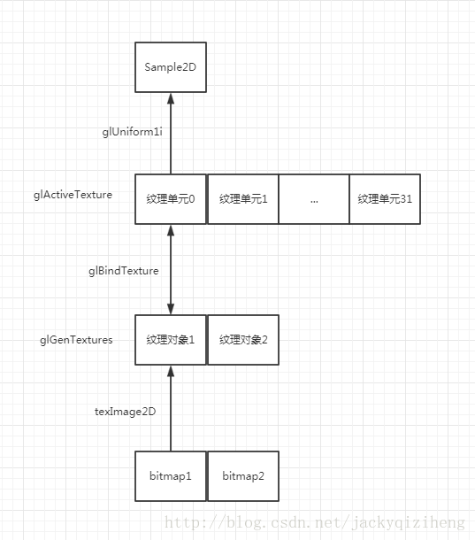

## 环绕方式

## 纹理过滤

纹理坐标不依赖于分辨率，它可以是任意浮点值，所以OpenGL需要知道怎样将纹理像素映射到纹理坐标。

GL_NEAREST（也叫临近过滤）是OpenGL默认的纹理过滤方式。
当设置为GL_NEAREST的时候，OpenGL会选择中心点最接近纹理坐标的那个像素。

GL_LINEAR(也叫线性过滤)他会基于纹理坐标附近的纹理像素，计算出一个插值，近似出这些纹理像素之间的颜色。

## 多级渐远纹理(Mipmap)

## 纹理的使用过程

首先用glGenTextures方法创建纹理对象，该纹理对象是缓存在GPU的内存中的，可以同时有很多个纹理对象缓存在GPU中；

由此得到纹理对象的ID，再调用glBindTexture方法把刚才生成的纹理对象绑定到纹理单元中，其是在调用glBindTexture前少写了一句glActiveTexture(GL_TEXTURE0),这一句的意思是激活纹理单元0，没有写的话就是默认用纹理单元0

下面这些glTexParameteri就是对绑定的纹理对象进行设置

再调用texImage2D把bitmap存放在对应的纹理对象中。配置好上面的设置后，通过glUniform1i告诉fragment shader需要使用纹理单元0，所以传了一个0参数进去给sampler2D，这个采样器就会到纹理单元0中去采样：

